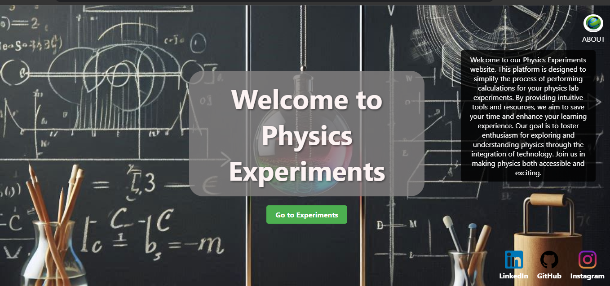
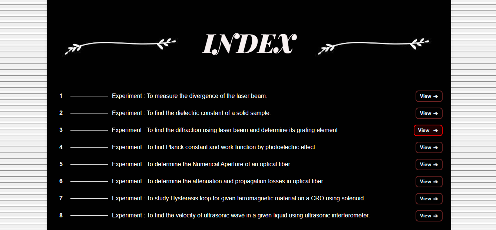
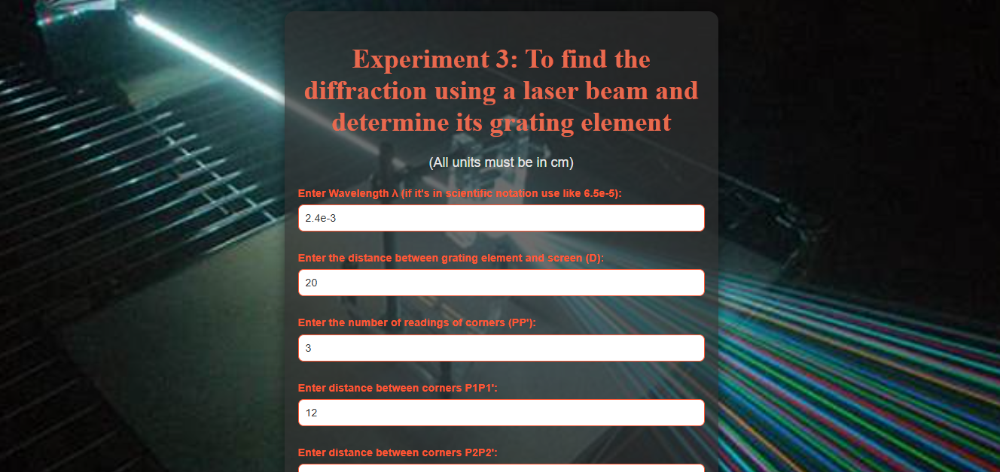
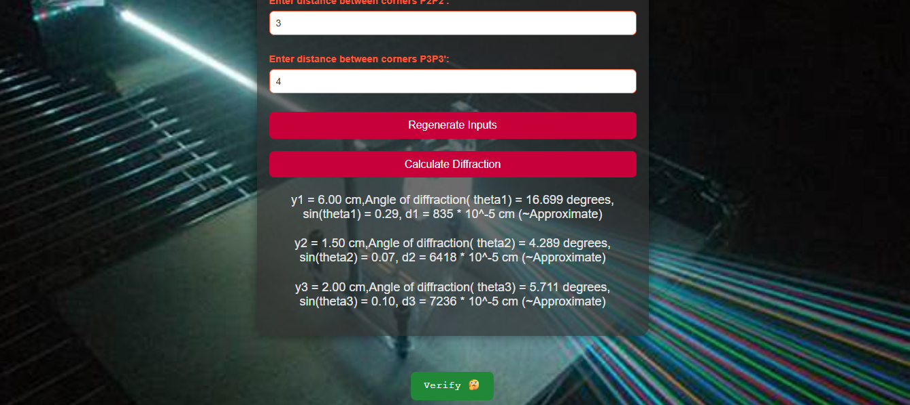
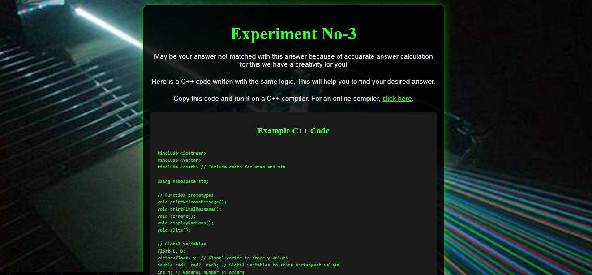

# 🧪 Physics Experimental Website

A simple web-based project showcasing various physics experiments designed for students to learn fundamental concepts visually and interactively.

## 🔗 Live Demo

👉 [Click here to visit the live site](https://physicspractical.netlify.app/)

---

##Screenshots-
#### home page

#### index page

#### experiment page

#### result page

#### verify Page 

---
## 📚 Description
This project helps students understand core physics experiments by providing an intuitive and interactive interface to simulate and explore real-world concepts.

## 📌 Features

- Interactive UI for the better learning experience
- Visual representation of common physics experiments
- Responsive design for desktop and mobile
- Easy navigation between different experiments

## 🛠 Tech Stack

- HTML5
- CSS3
- JavaScript

## 🚀 How to Run Locally
git clone https://github.com/ShehzadChouhan/physics-experimental-website.git
cd physics-experimental-website
open index.html

Made by Mohd Shehzad
